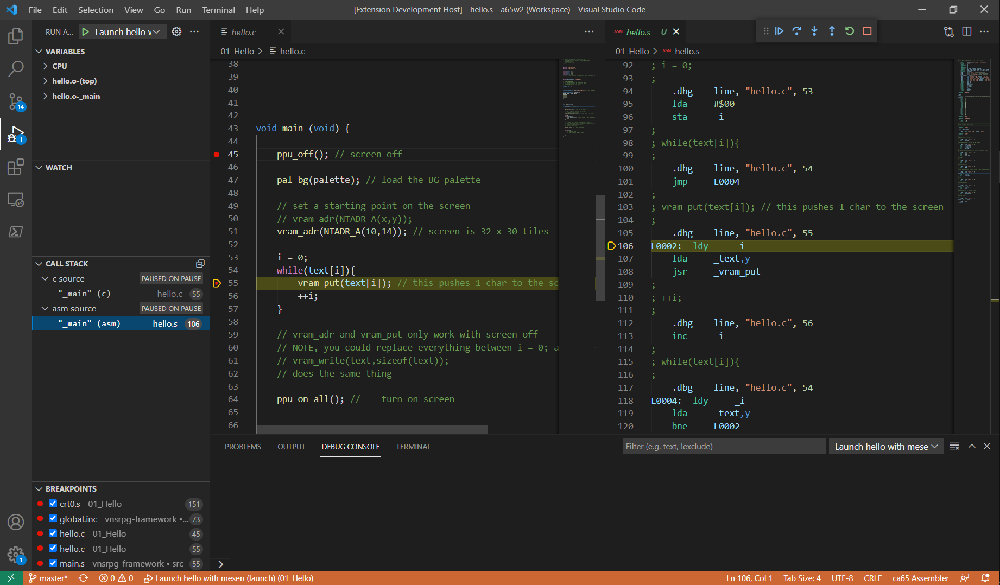

# Alchemy65 README

This vscode extension adds syntax and debugger support for cc65 and ca65, especially for NES development. Currently Alchemy65 only supports debugging with the latest version of Mesen-X, [available here](https://github.com/NovaSquirrel/Mesen-X/actions/runs/1442208843).

## Features

Alchemy65 brings the modern debugging experience to the world of NES homebrew development. Check out a few of the features:

**Set breakpoints and step through your code.**

**Follow along in both C and assembly.**

Watch variables and monitor the CPU state.

> Tip: Many popular extensions utilize animations. This is an excellent way to show off your extension! We recommend short, focused animations that are easy to follow.

## Getting It Set Up

1. **coming soon**

## Requirements

Alchemy65 works with the `.dbg` file generated cc65 / ca65 compilers. Remember to export your c symbols if you want a better debugging experience in c source code.

Alchemy65 currently only supports debugging through mesen-x, using a special lua script that allows Alchemy65 to inspect and control the emulator. Support for other emulators is _possible_ if the necessary integration points are exposed (pause/resume, breakpoints, single-step execution, PC location in both CPU and PRG address space, memory inspection, and so on).

Use "Add Configuration" to add Alchemy65 Launch and Attach configurations to your `launch.json` file.

## Known Issues

Calling out known issues can help limit users opening duplicate issues against your extension.

## Release Notes

Users appreciate release notes as you update your extension.

### 1.0.0

Initial release of Alchemy65

